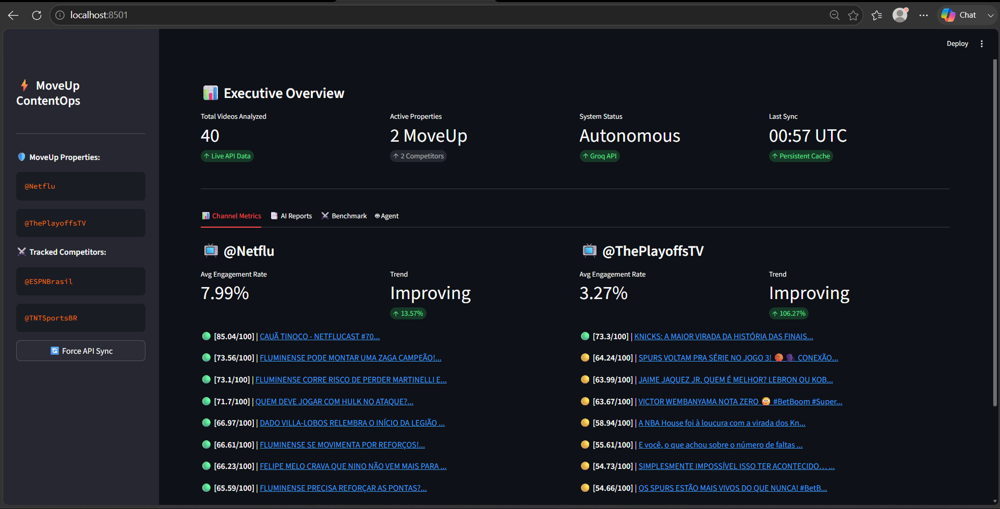

# ⚡ MoveUp ContentOps AI

**Role:** AI Automation & Operations Engineer | **Project:** MoveUp Content Ops Bot

---

## 🎯 Executive Summary
MoveUp ContentOps AI is an autonomous content intelligence platform designed to replace manual YouTube metric collection with an intelligent, agentic pipeline. It helps campaign managers monitor performance, benchmark competitors, and generate actionable strategic recommendations using natural language.

---

## 📸 Platform Previews

| Executive Dashboard | AI Insights Report | Competitive Benchmarking |
| :---: | :---: | :---: |
|  |  |  |

---

## 🚀 Key Features

### 📊 Content Analytics
* **Real-time Extraction:** Fetches the latest 10 videos per channel.
* **Deterministic Scoring:** Normalizes viral spikes using a logarithmic mathematical formula (View Performance 50%, Engagement 40%, Recency 10%).
* **Performance Tiering:** Automatically classifies content as *Strong*, *Average*, or *Underperforming*.

### 🧠 AI Intelligence & Reporting
* **Executive Synthesis:** Generates high-level summaries, diagnoses content patterns, and identifies "winning" vs "losing" themes.
* **Actionable Strategies:** Provides specific recommendations based on data-driven performance analysis.

### 🤖 Autonomous Agent
* **Multi-Tool Execution:** Supports natural language queries (e.g., *"Compare Netflu and ThePlayoffsTV"*).
* **Self-Correction:** Built with strict guardrails to prevent hallucinated metrics (like CTR/Retention, which are unavailable via public API).

### 📈 Competitive Benchmarking
* Integrates sector competitors (`@ESPNBrasil`, `@TNTSportsBR`) to provide a relative market analysis, calculating engagement gaps against industry standards.

---

## 🏗️ Enterprise Architecture

```text
moveup-content-ops-bot/
│ ├── config/
│ └── channels.json
│ ├── data/
│ ├── cache/
│ └── reports/
│ ├── screenshots/
│ ├── src/
│ ├── agent.py
│ ├── analytics.py
│ ├── cache.py
│ ├── logger.py
│ ├── models.py
│ ├── prompts.py
│ ├── report_engine.py
│ ├── scheduler.py
│ └── youtube.py
│ ├── tests/
│ ├── test_analytics.py
│ └── test_system.py
│ ├── app.py
├── requirements.txt
├── .env.example
└── README.md
